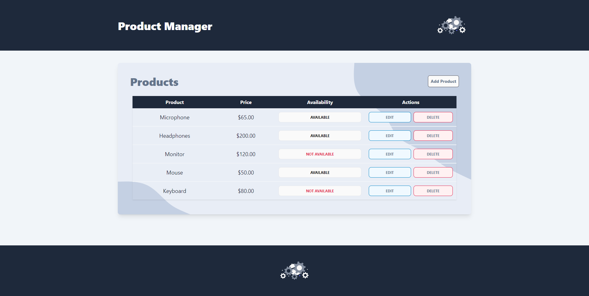
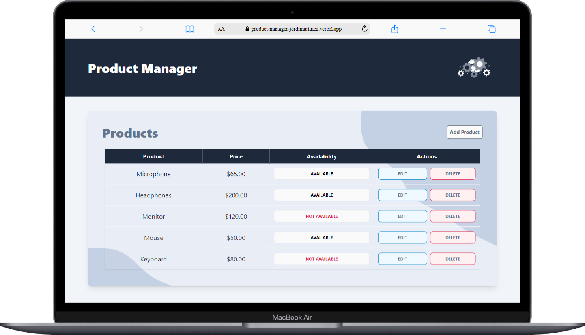
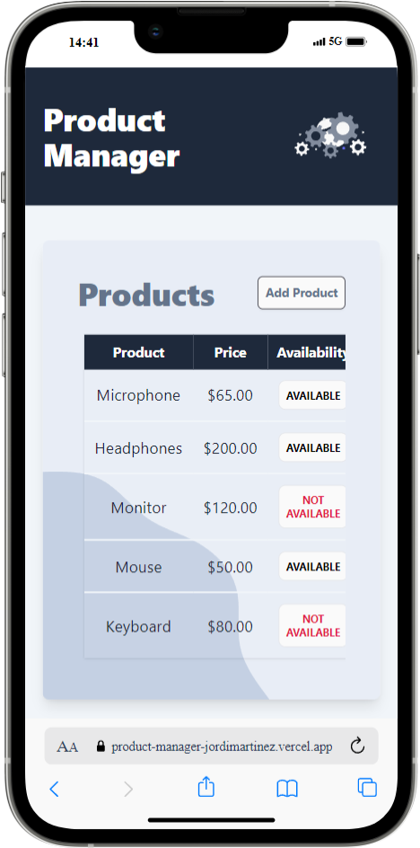
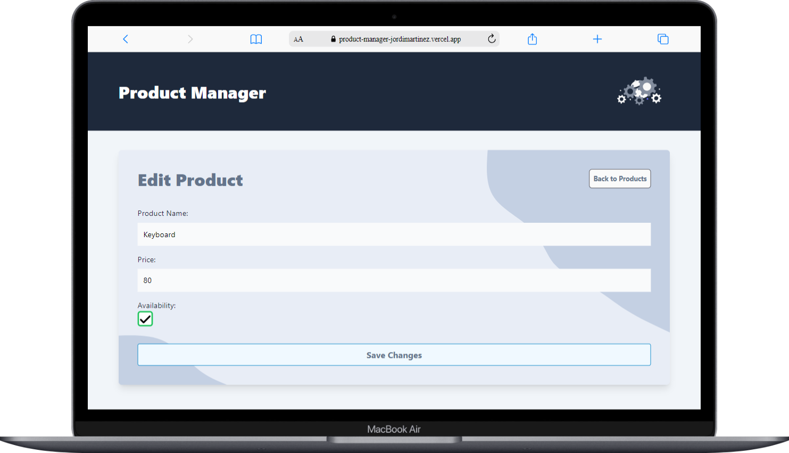
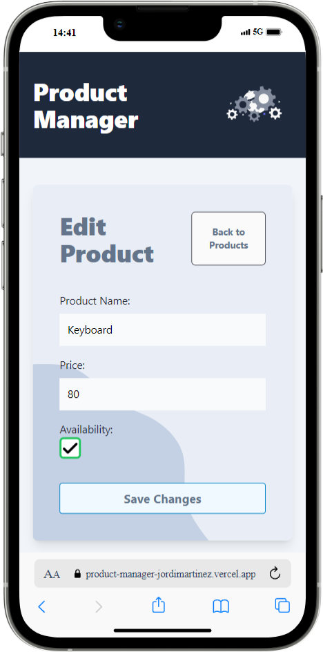

# 
# Product Manager

> A small webapp based on PERN stack. It consists of a product manager, where the user adds products, displays them and gives the option to edit or delete them. All this is handled with a database and instructions are given through an API.

## Demo 🎮

> 📝 First time deployment may take a few seconds because of the free hosting service.

Here is a working live demo:\
https://product-manager-jordimartinez.vercel.app

Link to API documentation:\
https://product-manager-server-c09l.onrender.com

## Project preview 💻

## Technologies 🛠️

The following technologies were used to develop this application:

- npm
- Vite
- React
- TypeScript
- TailwindCSS
- React Router DOM
- NodeJS
- ExpressJS
- Jest/Supertest
- Valibot
- Sequelize
- Swagger
- PostgresSQL
- HTML
- JavaScript

## Author

- **Name:** Jordi Martinez Jimenez
- **Contact:** 
- **Demo:** [Demo](https://product-manager-jordimartinez.vercel.app/)
- **API Doc:** [Demo](https://product-manager-server-c09l.onrender.com/)